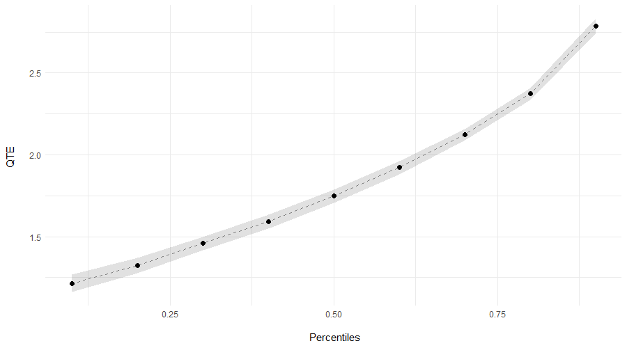
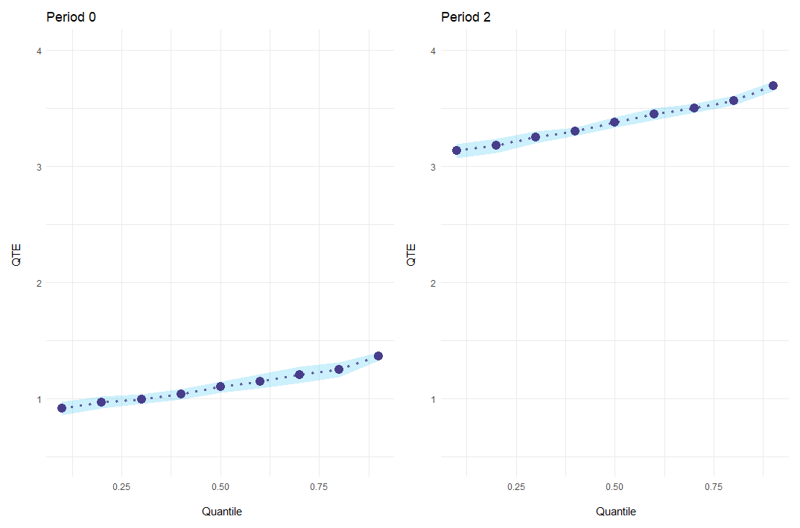
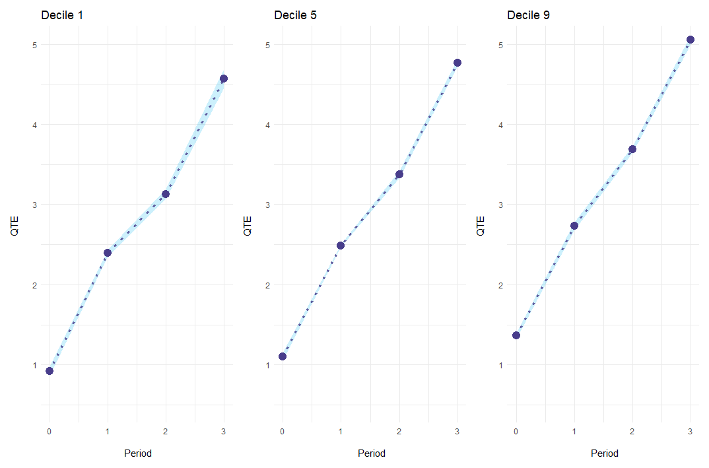

# ecic: Extended Changes-in-Changes

 <!-- badges: start -->
   [](https://github.com/frederickluser/ecic/actions/workflows/R-CMD-check.yaml)
 [](https://app.codecov.io/gh/frederickluser/ecic?branch=main)

 <!-- badges: end -->

`ecic` estimates a changes-in-changes model with multiple periods and 
cohorts as suggested in Athey and Imbens
([2006](https://doi.org/10.1111/j.1468-0262.2006.00668.x)).
Changes-in-changes is a generalization of the difference-in-differences approach, estimating
a treatment effect for the entire distribution instead of averages.

Athey and Imbens
([2006](https://doi.org/10.1111/j.1468-0262.2006.00668.x)).
show how to extend the model to multiple periods and cohorts, analogously to a Two-Way Fixed-Effects model for averages.
This package implements this, 
calculating standard errors via bootstrap and plotting results, aggregated or in an event-study-style fashion.

## Installation

You can install `ecic` from Github.

``` r
# install.packages("remotes")
remotes::install_github("frederickluser/ecic")
```

## Basic Example
### Estimation
Let's look at a short example how to use the package. First, load some simulated sample data.
``` r
library(ecic)
data(dat, package = "ecic")

head(dat)
#>  countyreal  first.treat   year time_to_treat   lemp
#>       <int>        <int>  <int>         <int>  <dbl>
#>           3        1980    1980             0   2.21
#>           3        1980    1981             1   3.33
#>           3        1980    1982             2   3.67
#>           5        1980    1980             0   2.77
#>           5        1980    1981             1   3.88
#>           5        1980    1982             2   3.80
```


Then, the function `ecic` estimates the changes-changes-model:
``` r
# Estimate the model
mod =
  ecic(
    yvar  = lemp,         # dependent variable
    gvar  = first.treat,  # group indicator
    tvar  = year,         # time indicator
    ivar  = countyreal,   # unit ID
    dat   = dat,          # dataset
    boot  = "weighted",   # bootstrap proceduce ("no", "normal", or "weighted")
    nReps = 20            # number of bootstrap runs
    )
```
`mod`contains for every bootstrap run a list of all 2-by-2 combinations (`$name_runs`) and the point-estimates.
`cic_summary` combines this and adds standard errors:

``` r
(mod_res = cic_summary(mod) )

#> perc     coefs         se
#>  0.1 0.9073873 0.02286149
#>  0.2 0.9792253 0.02027064
#>  0.3 1.0648871 0.01912238
#>  0.4 1.1891874 0.01744996
#>  0.5 1.3155999 0.02326969
#>  0.6 1.4437203 0.02334389
#>  0.7 1.5922397 0.02342538
#>  0.8 1.7792516 0.01728373
#>  0.9 2.1140103 0.02014776
```

### Plotting
Finally, results can be plotted using `cic_plot`.
``` r
cic_plot(mod_res)
```
<p align="center"> 
 
</p>

## Event-Study Example
The package also allows to report _event-study-style_ results of the effect.
To do so, simply add the `es = T` argument to the estimation and `cic_summary` will report effects for every event period.
``` r
# Estimate the model
mod =
  ecic(
    yvar  = lemp,         # dependent variable
    gvar  = first.treat,  # group indicator
    tvar  = year,         # time indicator
    ivar  = countyreal,   # unit ID
    dat   = dat,          # dataset
    es    = T,            # report an event study
    boot  = "weighted",   # bootstrap proceduce ("no", "normal", or "weighted")
    nReps = 20            # number of bootstrap runs
    )

# report results for every event period
(mod_res = cic_summary(mod) )


#> [[1]]
#> perc es     coefs          se
#>  0.1  0 0.9082170 0.042402882
#>  0.2  0 0.9477988 0.009436464
#>  0.3  0 0.9694125 0.013942156
#>  0.4  0 1.0245454 0.019189802
#>  0.5  0 1.0777637 0.011401043
#>  0.6  0 1.1171074 0.005535331
#>  0.7  0 1.1652509 0.008632115
#>  0.8  0 1.2195577 0.014800394
#>  0.9  0 1.3256676 0.015221564

#> [[2]]
#> perc es    coefs          se
#>  0.1  1 2.270552 0.014901316
#>  0.2  1 2.225630 0.004805656
#>  0.3  1 2.219548 0.018903208
#>  0.4  1 2.254401 0.019642641
#>  0.5  1 2.279502 0.011910761
#>  0.6  1 2.285906 0.015449291
#>  0.7  1 2.305432 0.014775212
#>  0.8  1 2.346030 0.004632288
#>  0.9  1 2.408531 0.029807759

#> [...]
```
### Plotting
Event-study results can be plotted for every period individually with the option `es_type = "for_periods"`.
``` r
cic_plot(
    mod_res, 
    periods_plot = c(0, 2),   # which periods you want to show
    es_type = "for_periods",  # plots by period
    ylim = c(.5, 4)           # same y-axis
    )
```

<p align="center"> 
 
</p>

Alternatively, `es_type = "for_quantiles"` generates one plot for every quantile of interest.
``` r
cic_plot(
    mod_res, 
    periods_plot = c(.1, .5, .9), # which quantiles you want to show
    es_type = "for_quantiles",    # plots by period
    ylim = c(0, 4),               # same y-axis
    zero_line = T                 # add a horizontal line at y = 0
    )
```
<p align="center"> 
 
</p>

## Under the hood
### Estimation
For every treated cohort, we observe the distribution of the potential outcome $Y(1)$. 
In the case of two groups / cohorts and two periods, Athey and Imbens ([2006](https://doi.org/10.1111/j.1468-0262.2006.00668.x)).
show how to construct the counterfactual $Y(0)$.
This extends to the case with multiple cohorts and periods, where every not-yet-treated cohort is a valid comparison group.

Since we cannot simply average Quantile Treatment Effects, we must first store the empirical CDF of $Y(1)$ and $Y(0)$ for every two-by-two case. Note that, therefore, we cannot estimate a QTE for units treated in the first (no pre-period) and last period (no comparison cohort) and have to skip small cohorts (default `nMin = 40`) as we need more observations to estimate QTEs compared to an average effect.

### Aggregation
Next, I aggregate all estimated CDFs to get the plug-in estimates of $Y(1)$ and $Y(0)$, weighting for the cohort sizes.
Technically, `ecic` generates a grid of size `no_imp = 1e5` and imputes all empirical CDFs.

### Bootstrap
I calculate standard errors by bootstrap. I resample with replacement the entire dataset and estimate $Y(1)$ and $Y(0)$ `nRep` times (default `nReps = 100`).
This part can be parallelized by setting `nCores > 1`.
