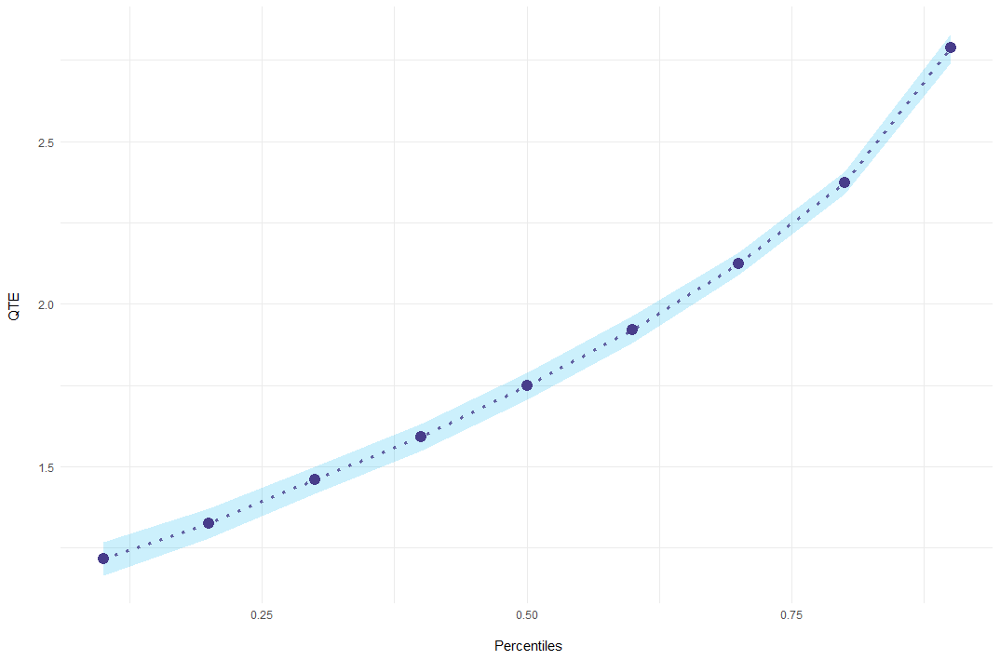

<a href="https://frederickluser.github.io/ecic/"></a>
# Extended Changes-in-Changes (ECIC)     
[](https://github.com/frederickluser/ecic/actions/workflows/R-CMD-check.yaml)

`ecic` estimates a changes-in-changes model with multiple periods and 
cohorts as suggested in Athey and Imbens ([2006](https://scholar.harvard.edu/imbens/publications/identification-and-inference-nonlinear-difference-differences-models)).
Changes-in-changes is a generalization of the difference-in-differences approach, estimating
a treatment effect for the entire distribution instead of averages.

Athey and Imbens
([2006](https://scholar.harvard.edu/imbens/publications/identification-and-inference-nonlinear-difference-differences-models)).
show how to extend the model to multiple periods and cohorts, analogously to a Two-Way Fixed-Effects model for averages.
This package implements this, 
calculating standard errors via bootstrap and plotting results, aggregated or in an event-study-style fashion.

## Installation

You can install `ecic` from GitHub.

``` r
# install.packages("remotes")
remotes::install_github("frederickluser/ecic")
```

## Basic Example
### Estimation
Let's look at a short example how to use the package. First, load some simulated sample data.
``` r
library(ecic)
data(dat, package = "ecic")

head(dat)
#>  countyreal  first.treat   year time_to_treat   lemp
#>       <int>        <int>  <int>         <int>  <dbl>
#>           3        1980    1980             0   2.21
#>           3        1980    1981             1   3.33
#>           3        1980    1982             2   3.67
#>           5        1980    1980             0   2.77
#>           5        1980    1981             1   3.88
#>           5        1980    1982             2   3.80
```


Then, the function `ecic` estimates the changes-changes-model:
``` r
# Estimate the model
mod =
  ecic(
    yvar  = lemp,         # dependent variable
    gvar  = first.treat,  # group indicator
    tvar  = year,         # time indicator
    ivar  = countyreal,   # unit ID
    dat   = dat,          # dataset
    boot  = "weighted",   # bootstrap proceduce ("no", "normal", or "weighted")
    nReps = 10            # number of bootstrap runs
    )
```
`mod`contains for every bootstrap run a list of all 2-by-2 combinations (`$name_runs`) and the point-estimates.
`summary` combines this and adds standard errors:

``` r
mod_res = summary(mod) 

#> perc    coefs         se
#>  0.1 1.215531 0.02670761
#>  0.2 1.324130 0.02310521
#>  0.3 1.458270 0.02105119
#>  0.4 1.590848 0.02128534
#>  0.5 1.747296 0.02098057
#>  0.6 1.921818 0.02135982
#>  0.7 2.124138 0.01802972
#>  0.8 2.372483 0.01799869
#>  0.9 2.787395 0.02241811

```

### Plotting
Finally, results can be plotted using `ecic_plot`.
``` r
ecic_plot(mod_res)
```
<p align="center"> 
 
</p>

## Event-Study Example
The package also allows to report _event-study-style_ results of the effect.
To do so, simply add the `es = T` argument to the estimation and `summary` will report effects for every event period.
``` r
# Estimate the model
mod =
  ecic(
    yvar  = lemp,         # dependent variable
    gvar  = first.treat,  # group indicator
    tvar  = year,         # time indicator
    ivar  = countyreal,   # unit ID
    dat   = dat,          # dataset
    es    = T,            # report an event study
    boot  = "weighted",   # bootstrap proceduce ("no", "normal", or "weighted")
    nReps = 10            # number of bootstrap runs
    )

# report results for every event period
mod_res = summary(mod) 

#> [[1]]
#> perc es     coefs         se
#>  0.1  0 0.9175263 0.02924326
#>  0.2  0 0.9675225 0.02508082
#>  0.3  0 0.9959150 0.02116782
#>  0.4  0 1.0388312 0.02373263
#>  0.5  0 1.0992322 0.02558309
#>  0.6  0 1.1496203 0.03078493
#>  0.7  0 1.2049797 0.03654320
#>  0.8  0 1.2519476 0.03291178
#>  0.9  0 1.3616626 0.01765538

#> [[2]]
#> perc es    coefs          se
#>  0.1  1 2.393816 0.022273736
#>  0.2  1 2.386941 0.020039276
#>  0.3  1 2.423415 0.017145110
#>  0.4  1 2.452259 0.017982620
#>  0.5  1 2.484616 0.009979006
#>  0.6  1 2.525388 0.012816760
#>  0.7  1 2.575615 0.015196499
#>  0.8  1 2.630959 0.019570320
#>  0.9  1 2.730742 0.024796025

#> [...]
```
### Plotting
Event-study results can be plotted for every period individually with the option `es_type = "for_periods"`.
``` r
ecic_plot(
    mod_res, 
    periods_plot = c(0, 2),   # which periods you want to show
    es_type = "for_periods",  # plots by period
    ylim = c(.5, 4)           # same y-axis
    )
```

<p align="center"> 
 
</p>

Alternatively, `es_type = "for_quantiles"` generates one plot for every quantile of interest.
``` r
ecic_plot(
    mod_res, 
    periods_plot = c(.1, .5, .9), # which quantiles you want to show
    es_type = "for_quantiles",    # plots by period
    ylim = c(.5, 5)               # same y-axis
    )
```
<p align="center"> 
 
</p>

## Under the hood
### Estimation
For every treated cohort, we observe the distribution of the potential outcome $Y(1)$. 
In the case of two groups / cohorts and two periods, Athey and Imbens ([2006](https://scholar.harvard.edu/imbens/publications/identification-and-inference-nonlinear-difference-differences-models)).
show how to construct the counterfactual $Y(0)$.
This extends to the case with multiple cohorts and periods, where every not-yet-treated cohort is a valid comparison group.

Since we cannot simply average Quantile Treatment Effects, we must first store the empirical CDF of $Y(1)$ and $Y(0)$ for every two-by-two case. Note that, therefore, we cannot estimate a quantile treatment effect for units treated in the first (no pre-treatment period) and last period (no comparison cohort) and have to skip small cohorts (default `nMin = 40`) as we need more observations to estimate quantile treatment effects compared to an average effect.

### Aggregation
Next, I aggregate all estimated CDFs to get the plug-in estimates of $Y(1)$ and $Y(0)$, weighting for the cohort sizes.
Technically, `ecic` generates a grid over the dependent variable and imputes all empirical CDFs.

### Bootstrap
I calculate standard errors by bootstrap. I resample with replacement the entire dataset and estimate $Y(1)$ and $Y(0)$ `nRep` times (default `nReps = 100`).
This part can be parallelized by setting `nCores > 1`.
